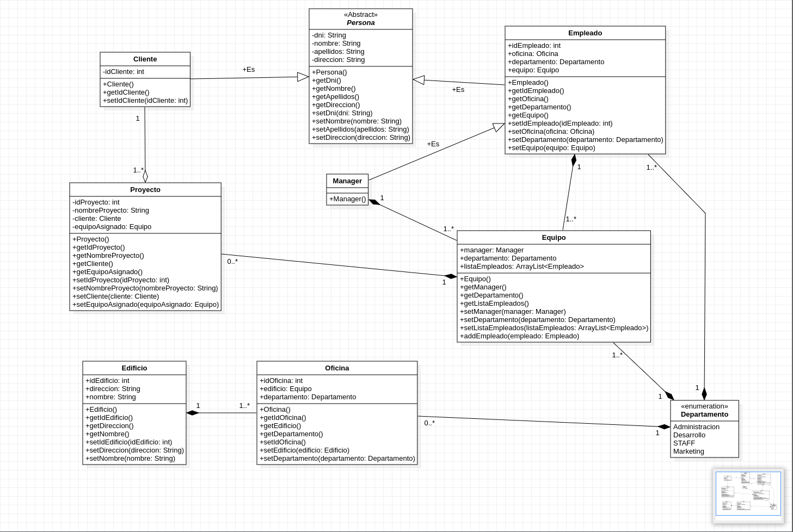
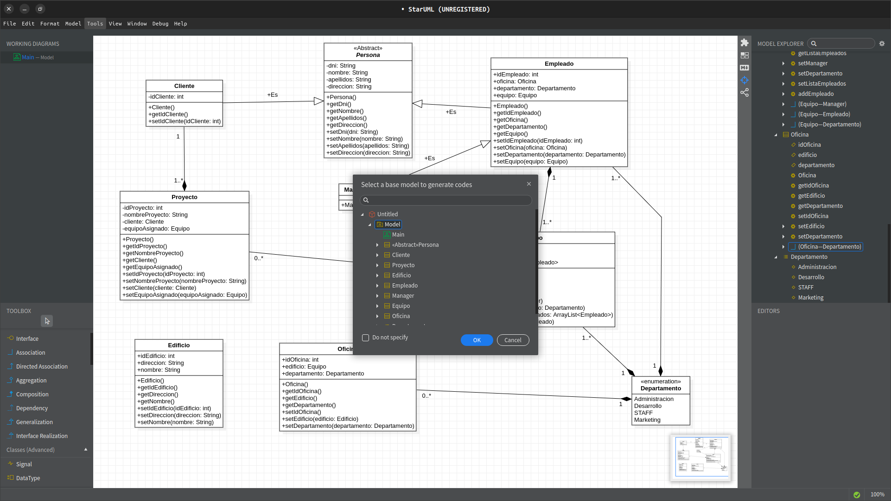
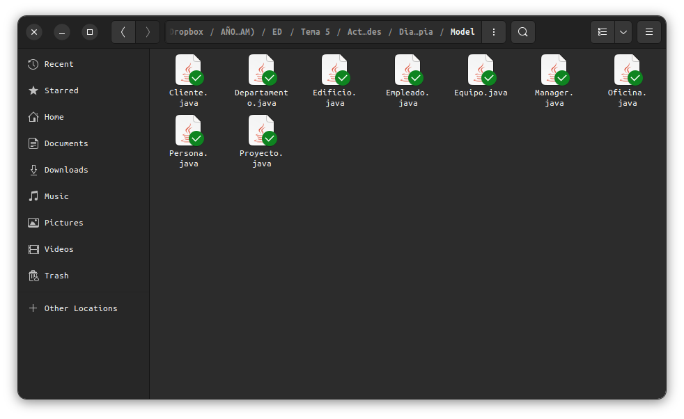

# Diagrama UML de cosecha propia

Para esta práctica de la asignatura de Entornos de Desarrollo (DAM) se pide el desarrollo de un diagrama de clases UML diseñado desde 0 (cosecha propia), para la parte obligatoria y la investigación sobre un software que permita traducir este tipo de diagramas a un lenguaje de programación (en nuestro caso Java).

El enunciado puede encontrarse en el siguiente [PDF](https://github.com/CharlyMech/UML-cosecha-propia/blob/main/DiagramaClasesUMLCosechapropia.pdf) en este repositorio.

## Parte A (Obligatoria)

#### Enunciado del problema a resolver:

Se plantea la siguiente situación: se quiuere llevar un registro en una empresa, la cual tiene sus diferentes oficinas repartidas en varios edificios (en la misma cuidad), de los proyectos que les encargan. El funcionamiento interno de la empresa es el siguiente:

-  Los clientes (los cuales son identificados internamente por el sistema) solicitan proyedctos, los cuales son asignados a equipos (un equipo por proyecto).
-  Los equipos se componen de varios empleados y un manager (el cual es un empleado). Los equipos pertenecen a un departamento, al igual que los empleados.
-  Un empleado únicamente puede estar en un proyecto, es decir equipo, siumultáneamente. Los empleados perteneces también a un departamento. Cada empleado tiene asignada una oficina.
-  Las oficinas pertenecen únicamente a un edificio y además cada oficina tiene asignada un departamento.
-  Los departamentos disponibles son 4: Administración, Desarrollo, STAFF y Marketing.

#### Solución:

## Parte B (Optativa)

Una parte del enunciado de la Parte A de esta práctica indica que se tiene que proporcionar el código fuente del diagrama antes planteado. He decidido responder o proporcionar la información requerida de ese apartado en este punto de la práctica ya que se puede aprovechar el objetivo de esta parte.

Para realizar esta tarea he utilizado un software llamado [StarUML](https://staruml.io/).

Cuando se tiene el modelo ya creado (imagen del apartado anterior) se accede al menú de la parte superior, se selecciona _Tools_ (o herramientas) > Java (hay que instalar el plugin) > _Generate Code_.

Se selecciona el modelo que se quiere exportar, como se ve en la imagen, y se selecciona la carpeta de destino. Al final se podrá ver que están todas las clases anteriormente diseñadas en el diagrama.

#### A tener en cuenta sobre StarUML

Como se puede ver en los archivos que han sido exportados ([Directorio](https://github.com/CharlyMech/UML-cosecha-propia/tree/main/Model)), el constructor que se puede ver en la [captura de pantalla](https://github.com/CharlyMech/UML-cosecha-propia/blob/main/Fotos/cosechaPropia.png) se crea como método a parte y se generan de forma automática los constructores.

Otra cosa a tener en cuenta es que para los métodos _GETTERS_ no se puede especificar el tipo de _output_ (al menos no lo he sabido configurar), por lo que si se desea generar el código a partir del diagrama, se tiene que tener en cuenta para cambiarlo posteriormente.
